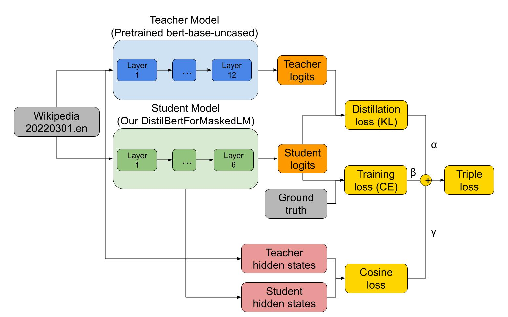
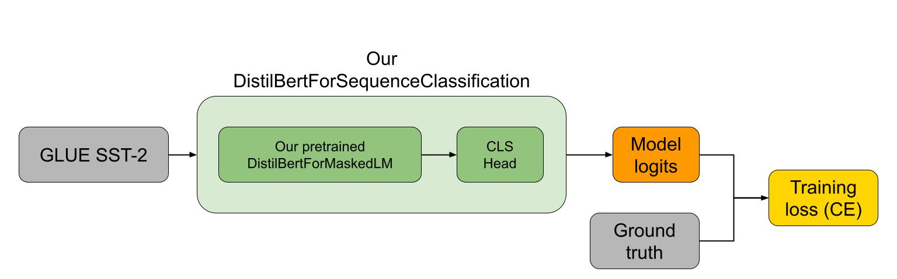
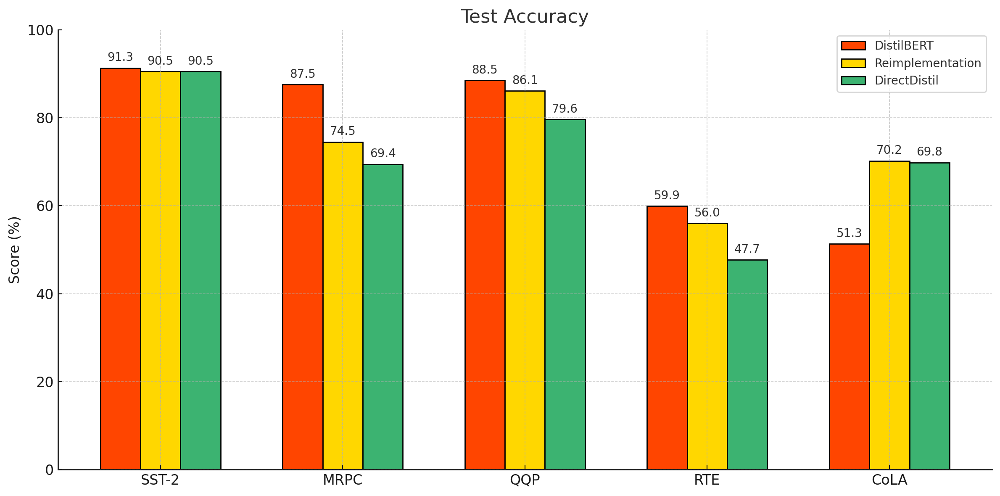

# 5782final_DistilBERT

## Introduction
This repository contains the implementation of a project that re-implements the paper "DistilBERT: A Distilled Version of BERT". The main contribution of the paper is the introduction of a smaller, faster, and lighter version of BERT, which retains 97% of its language understanding capabilities while being 60% faster.

## Chosen Result
We aimed to reproduce the performance of DistilBERT on the GLUE benchmark, focusing on five binary classification tasks: SST-2, MRPC, QQP, CoLA, and RTE. These results are fundamental in demonstrating that DistilBERT achieves comparable accuracy to BERT while being computationally efficient. The original paper's results on these tasks range from 51% accuracy on CoLA to 91% on SST-2. See Figure 1 in the original paper for reference.

## GitHub Contents
- **code/**: Contains all the scripts for training, fine-tuning, and evaluating the DistilBERT model.
  - `direct_distil.py`: Directly train DistilBERT on task-specific datasets without pretraining, and then evaluate on the test split of the same dataset.
  - `finetune.py`: Fine-tuning DistilBERT for specific tasks, and for each fine-tuned model evaluate on all 5 tasks.
  - `model.py`: Implementation of the DistilBERT architecture.
  - `pretrain.py`: Pretraining script for DistilBERT on English Wikipedia
- **data/**: Instruction for datasets. All data is publicly available at the time of this project.
- **results/**: Contains results and performance metrics.
- **poster/**: Project poster summarizing the work.
- **report/**: Final report detailing the implementation and findings.

## Re-implementation Details
### Methodology
- **Model Architecture**:
  
  
  - Pretrained `bert-base-uncased` (12 layers) as the teacher model.
  - DistilBERTForMaskedLM (6 layers) as the student model, trained using knowledge distillation on the Wikipedia dataset.
  - Fine-tuned DistilBERTForSequenceClassification for SST-2 sentiment classification by adding a classification head.
  - Additional (alternative approach): directly trained DistilBERTForSequenceClassification by distillation on the teacher model using the task datasets.
- **Datasets**:
  - Pretraining: English Wikipedia (20220301.en).
  - Fine-tuning and alternative approach: GLUE SST-2, MRPC, QQP, CoLA, and RTE datasets.
- **Evaluation Metrics**:
  - Loss on the test dataset after pretraining.
  - Accuracy on each of the 5 binary classification tasks.
- **Modifications**:
  1. Used only English Wikipedia for pretraining (Toronto Book Corpus was unavailable).
  2. Initialized the student model with random weights instead of the teacher's weights.
  3. Pretrained the model for 1 epoch; fine-tuned for 3 epochs.
  4. Explored an alternative approach of direct training on smaller datasets.

## Reproduction Steps
1. Ensure access to a GPU for efficient training and evaluation. We ran the project on a NVIDIA RTX 4070 GPU with 12 GB VRAM. The tokenization was done on a 22 core Intel Core Ultra 9 CPU. Adjust your batch size and NUM_PROC to match your device. The pretrain took us about 19 hours. Fine tune or direct distil took about 1 to 1.5h each.

2. Clone the repository:
   ```bash
   git clone git@github.com:TimesECS/5782final_DistilBERT.git
   cd 5782final_DistilBERT
   ```
3. Install dependencies:
   ```bash
   pip install -r code/requirements.txt
   ```
4. Pretrain the model:
   ```bash
   python code/pretrain.py
   ```
5. Fine-tune the model on each of the 5 datasets, and test each fine-tuned model on all 5:
   ```bash
   python code/finetune.py
   ```
   ##### Results and checkpoints will be saved in a ./checkpoint folder

6. Try the alternative approach and evaluate:
   ```bash
   python code/direct_distil.py
   ```
   ##### Results and checkpoints will be saved in a ./checkpoints_direct_distil folder

## Results/Insights

- Comparable performance on SST-2, QQP, and RTE; better performance on CoLA; worse performance on MRPC compared to the original DistilBERT for both approaches.
- Direct distillation performs slightly less than our re-implementation with pretraining on MRPC, QQP and RTE.

## Conclusion
### Key takaways
This project demonstrates the feasibility of reproducing DistilBERT's results using open-source tools. Key takeaways include:
- Our re-implementation of DistilBERT has performance close to the original model on the binary classification tests in GLUE.
- Alternative very light-weight approach exists for specific tasks, by directly distilling the teacher model using data for that task.

### Lessons Learned
- Ensure code runs and checkpoints are saved before committing to long training processes.
- Parallelize CPU-intensive tasks like tokenization and save intermediate results.

## References
- Sanh, V., Debut, L., Chaumond, J., & Wolf, T. (2019). DistilBERT, a distilled version of BERT: smaller, faster, cheaper, and lighter. arXiv preprint arXiv:1910.01108.
- Hugging Face Transformers: https://huggingface.co/transformers/
- Wang, A., et al. (2019). GLUE: A Multi-Task Benchmark and Analysis Platform for Natural Language Understanding. arXiv preprint arXiv:1904.09482.

## Acknowledgements
This project was completed as part of the CS5782 course at Cornell Ann S. Bowers College of Computing and Information Science. Special thanks to Kilian Q. Weinberger, Jennifer J. Sun and teaching assistants for their guidance and support.